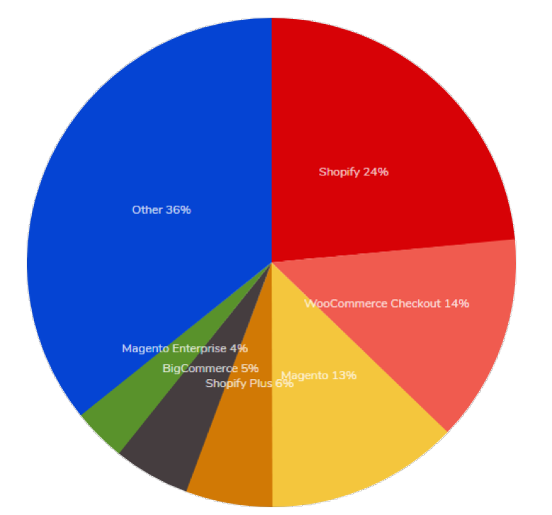
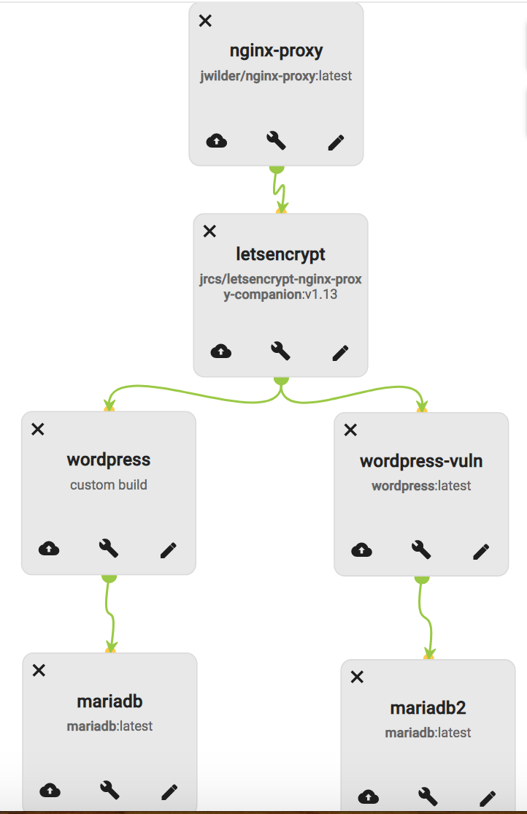
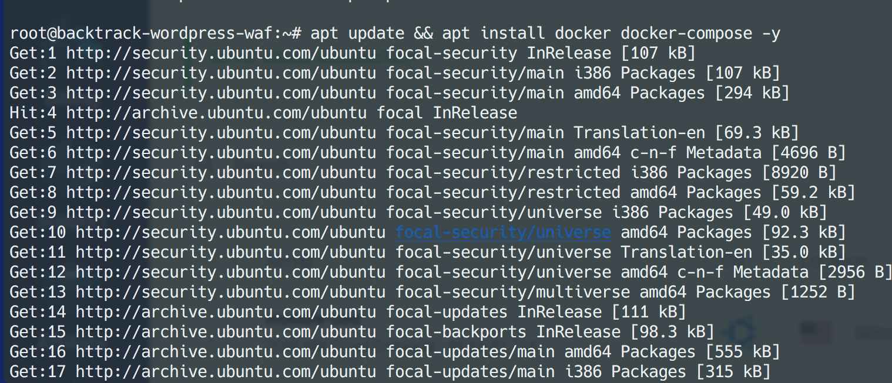
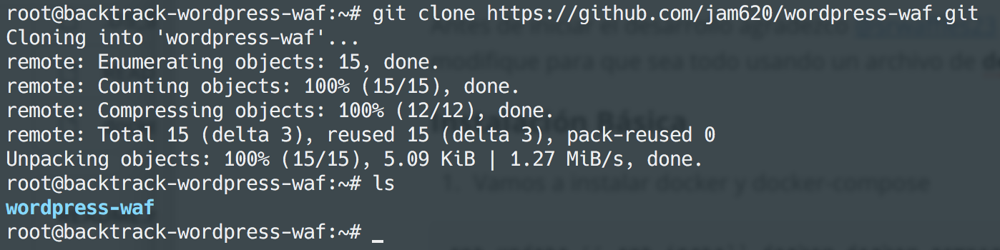
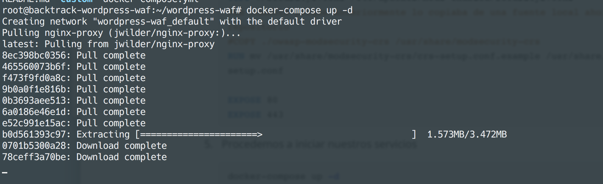
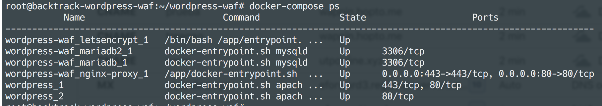
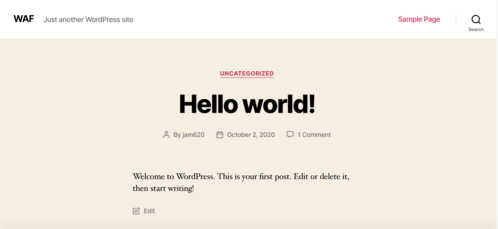
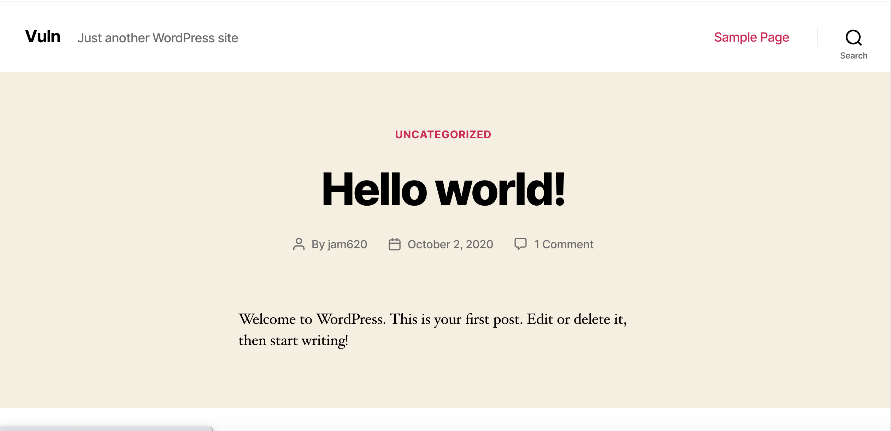
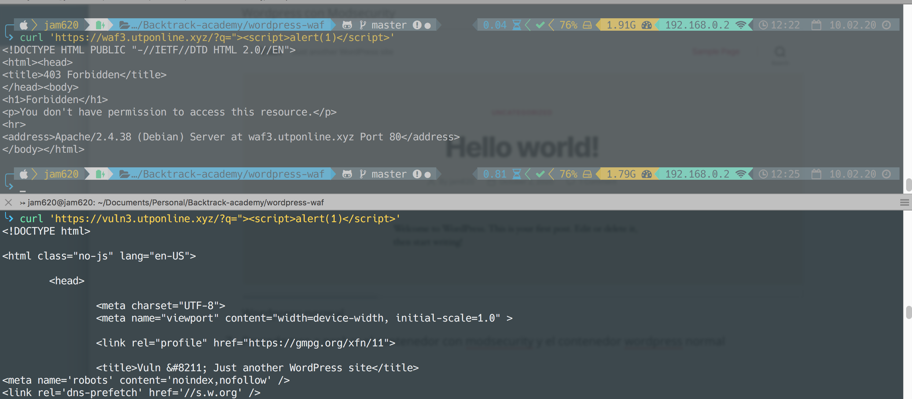
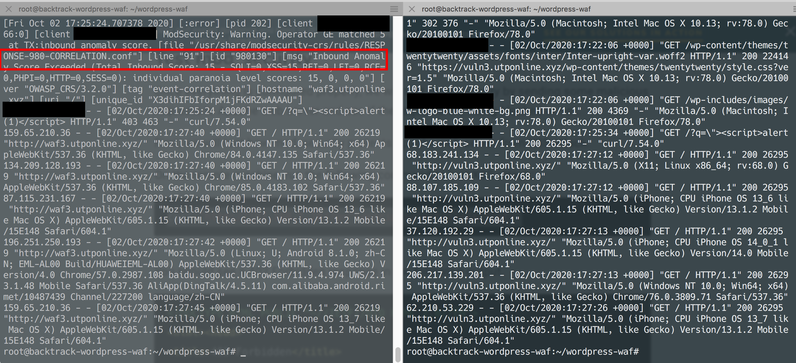

# Wordpress WAF

Todos sabemos que wordpress es el CMS más utilizado en la actualidad y más aún con la pandemia la cantidad de comercios que han sido forzados a una transformación digital de su negocio, vendiendo sus productos o brindando sus servicios a través de esta plataforma. La siguiente imagen es la distribución para sitios que utilizan tecnologías ecommerce, Top 100k sitios siendo un 14% el plugin de woocomerce para wordpress, si buscamos en el sitio de [kinsta](https://kinsta.com/blog/wordpress-site-examples/) encontramos que el 30% de los sitios desarrollados en el mundo utilizan wordpress.



El siguiente articulo tiene como objetivo crear un wordpress con modsecurity preinstalado para utilizar en las clases de seguridad de aplicaciones. Encontraremos el **docker-compose.yml** y el **dockerfile** que permite realizar este trabajo. 

#### Resumen 

Un WAF (Web Aplicattion Firewall) es un firewall a nivel de aplicación el cual protege tus aplicaciones web de ataques que, normalmente, son un dolor de cabeza para los administradores de las aplicaciones o para los dueños de las mismas, obviamente no es infalible pero detiene los ataques de los script kiddies y dificultad el trabajo de los cibercriminales si se mantienen las reglas actualizadas.

Uno de los WAF más utilizados es [ModSecurity](https://www.modsecurity.org/). Originalmente, se escribió como un módulo para el servidor web Apache, pero desde entonces se ha adaptado a NGINX e IIS. ModSecurity protege contra ataques buscando:

*  Inyección SQL.
* Asegurarse de que el tipo de contenido coincida con los datos del cuerpo.
* Protección contra solicitudes POST con formato incorrecto.
* Protección del protocolo HTTP.
* Búsquedas de listas negras en tiempo real.
* Protecciones de denegación de servicio HTTP.
* Protección genérica contra ataques web.
* Detección y ocultación de errores.

En esta ocasión utilizaremos docker para crear un balanceador principal hacia dos contenedores, uno el cual contiene una imagen personalizada de wordpress con mod security (**waf**) y otro sin mod security para probar los ataques (**vuln**).



#### Requisitos

1. Un servidor vps con 55GB SSD, 1 CPU, 2048MB recomiendo usar el proveedor [vultr.com](https://www.vultr.com/?ref=7249687)
2. Instalar docker y docker-compose en el vas
3. Un Domino que podamos crear varios subdominios.

#### Agradecimientos

Antes de iniciar el desarrollo agradezco [@srwaffles23](https://gitlab.com/srwaffles23/secure-wordpress) donde obtuve el repositorio base que luego modifique para que sea todo usando un archivo de **docker-compose.yml**

#### Instalación Básica

1. Vamos a instalar docker y docker-compose

```shell
apt update && apt install docker docker-compose -y
```



2. clonamos el repositorio

   ```shell
   git clone https://github.com/jam620/wordpress-waf.git
   ```

   

   

3. Vamos a explicar brevemente el contenido dentro del **docker-compose.yml**

   ```
   wordpress:
           build: 
               context: ./custom/wordpress
               dockerfile: dockerfile
   
           #image: wordpress:secure
           container_name: wordpress_1
           links:
            - mariadb:mysql
           expose:
            - 80
           environment:
            - WORDPRESS_DB_PASSWORD=qwertyqwerty
            - WORDPRESS_DB_USER=userwp
            - WORDPRESS_DB_NAME=wpdb
            - "VIRTUAL_HOST=waf.utponline.xyz"
            - "LETSENCRYPT_HOST=waf.utponline.xyz"
            - "LETSENCRYPT_EMAIL=jose.moreno@comunidaddojo.org"
           volumes:
            - ./web1/html:/var/www/html
   ```

   El servicio de wordpress esta creando una imagen custom para la implementación del **waf**  utilizando el contenedor de **wordpress** como base. 

   **Nota: **Debemos recordar reemplazar nuestra variables con nuestros datos, utilizando variables de entorno para que no estén en texto plano.

4. El archivo **Dockerfile** realiza la instalación de los paquetes necesarios y la modificación de los archivos para dejar el mod security funcionando, además que instalas las reglas del OWASP 

   ```dockerfile
   FROM wordpress:latest
   
   RUN apt-get update && \
   	apt-get install -y  --no-install-recommends ssl-cert libapache2-mod-security2 libapache2-mod-qos git && \
   	rm -r /var/lib/apt/lists/* && \
   	a2enmod ssl && \
   	a2ensite default-ssl
   RUN mv /etc/modsecurity/modsecurity.conf-recommended /etc/modsecurity/modsecurity.conf && \
   	sed -i 's/SecRuleEngine DetectionOnly/SecRuleEngine on/g' /etc/modsecurity/modsecurity.conf
   RUN git clone https://github.com/SpiderLabs/owasp-modsecurity-crs.git /usr/share/modsecurity-crs
   COPY ./security2.conf /etc/apache2/mods-enabled/security2.conf
   #se comenta porque anteriormente lo copiaba de una fuente local ahora se clona el repositorio
   #COPY ./owasp-modsecurity-crs /usr/share/modsecurity-crs
   RUN mv /usr/share/modsecurity-crs/crs-setup.conf.example /usr/share/modsecurity-crs/crs-setup.conf
   
   EXPOSE 80
   EXPOSE 443
   ```

5.  Procedemos a iniciar nuestros servicios 

   ```shell
   docker-compose up -d
   ```

   

   Si todo sale bien podemos visualizar nuestros servicios funcionando de la siguiente manera

   

6. Confirmamos e instalamos wordpress para el contenedor que tiene el modsecurity y el contenedor normal de wordpress.

   

   Wordpress con Modsecurity

   

   Wordpress normal

7. Procedemos a probar el contenedor con modsecurity y el contenedor wordpress normal

   Prueba al wordpress con el waf

   ```shell
   curl 'https://waf3.utponline.xyz/?q="><script>alert(1)</script>'
   ```

   Prueba al wordpress normal

   ```shell
   curl 'https://vuln3.utponline.xyz/?q="><script>alert(1)</script>'
   ```

   

   La imagen muestra en la parte de arriba la salida de la petición bloqueada por el mod security y en la parte de abajo observamos la petición normal al servidor.

   En los registros de los contenedores a la izquierda observamos la regla de owasp del modsecurity que se activaron al momento de realizar la petición de **XSS** y a la derecha la petición que es enviada sin ningún tipo de filtro.

   


#### Conclusiones

* Wordpress es el CMS más utilizado por su facilidad de uso y está bien que sea utilizado pues es sencillo y amigable con los usuarios, sitios como la [casa blanca](https://whitehouse.gov/) lo utilizan, por tanto no podemos ir contra la corriente, sin embargo debemos realizar el hardening necesario a la aplicación web pues sufre de igual manera de vulnerabilidades.
* La tecnología de los contenedores nos ha permitido crear nuestras imágenes a nuestro gusto y con las medidas de seguridad correspondientes a una aplicación web utilizando las reglas del OWASP proyecto especializado en seguridad para aplicaciones web.
* El waf solo es una medida que detendrá a aquellas personas que están iniciando en actividades delictivas o los conocidos mayormente como script kiddies un black hat experimentado encontrará las maneras para realizarle un bypass al mismo.
* Esta es una prueba de concepto que estamos iniciando podríamos añadirles notificaciones a servicios como slack o análisis de los ataques con grafana y prometheus.


#### Referencias

* R. (2018, 20 abril). How to Configure ModSecurity with Apache on Ubuntu Linux. Rapid7 Blog. https://blog.rapid7.com/2017/04/09/how-to-configure-modsecurity-with-apache-on-ubuntu-linux/
* Stewart, B. (2019, 14 enero). Securing Docker Containers with a Web Application Firewall (WAF) built on ModSecurity and NGINX. Wintellect. https://www.wintellect.com/securing-docker-containers-with-a-web-application-firewall-waf-built-on-modsecurity-and-nginx/
* Enikő, T. (s. f.). Ultimate WAF Guide – How to patch WordPress vulnerabilities and block web attacks | BitNinja.io - Full-stack server protection. BitNinja.io. Recuperado 2 de octubre de 2020, de https://bitninja.io/blog/waf-guide-patch-wordpress-vulnerabilities-block-web-attacks/
* Firewall para aplicaciones web (ModSecurity). (s. f.). Plesk Onyx documentation. Recuperado 2 de octubre de 2020, de https://docs.plesk.com/es-ES/onyx/administrator-guide/administraci%C3%B3n-del-servidor/firewall-para-aplicaciones-web-modsecurity.73383/